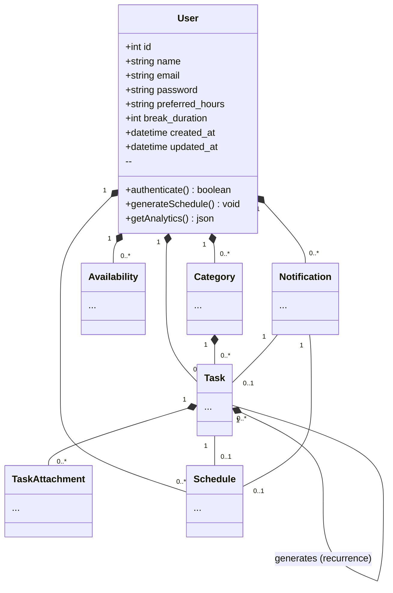
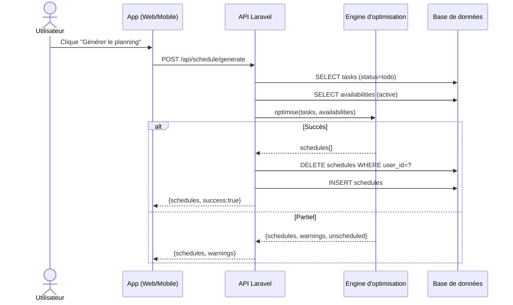

# SmartSchedule 

lien de l'application web : https://neo-solution.fr/


> **SmartSchedule** – une application web et mobile qui vous aide à planifier, organiser et optimiser votre emploi du temps quotidien.  
> Gérez vos tâches, définissez vos disponibilités, générez automatiquement un planning optimisé et recevez des notifications intelligentes.


## Table des matières

- [Aperçu](#aperçu)
- [Fonctionnalités](#fonctionnalités)
- [Architecture](#architecture)
- [Installation & Configuration](#installation--configuration)
- [Usage](#usage)
- [API REST (Laravel)](#api-rest-laravel)
- [Modèle de données (UML)](#modèle-de-données-uml)
- [Tests & CI](#tests--ci)
- [Déploiement](#déploiement)
- [Contributions](#contributions)
- [Licence](#licence)


## Aperçu

SmartSchedule combine une **interface web** (React + Vite) et une **application mobile** (React‑Native + Expo) avec un **backend Laravel**. Le cœur du système est un **algorithme d’optimisation** qui alloue les tâches aux créneaux de disponibilité de l’utilisateur.


## Fonctionnalités

 Fonctionnalité 
| **** | Authentification sécurisée (Laravel Sanctum, tokens JWT) |
| **** | Gestion des catégories, tâches, pièces jointes |
| **** | Définition des disponibilités (jours/horaires) |
| **** | Génération intelligente du planning (priorité, deadline, récurrence) |
| **** | Support de la récurrence (daily / weekly / monthly) |
| **** | Tableau de bord analytique (taux de complétion, temps moyen) |
| **** | Notifications push (Expo) et notifications in‑app (broadcast) |
| **** | Vue calendrier interactif (drag‑&‑drop, mise à jour du statut) |
| **** | Cron / Scheduler pour les rappels de deadline |
| **** | Tests unitaires et d’intégration (PHPUnit, Jest) |


## Architecture

```mermaid
flowchart LR
    subgraph FrontendWeb [Web (React + Vite)]
        UI[UI Components]
        Store[State Store]
        API[Axios Calls]
    end

    subgraph FrontendMobile [Mobile (React‑Native + Expo)]
        UI_M[UI Components]
        Store_M[Redux / Context]
        API_M[Axios Calls]
    end

    subgraph Backend [Laravel API]
        Controllers[Controllers]
        Services[Services (Planning Engine)]
        Jobs[Jobs & Commands]
        Models[Eloquent Models]
        DB[(MySQL Database)]
    end

    UI --> API --> Controllers --> Services --> DB
    UI_M --> API_M --> Controllers
    Jobs --> Services
    Notifications --> Users
```

- **Frontend** utilise **Axios** pour consommer l’API Laravel.  
- **Backend** expose des routes REST, utilise **Eloquent** pour le mapping ORM, et un **Job** (`ScheduleGenerationJob`) pour le calcul du planning.  
- **Cron** : `CheckTaskDeadlines` exécute chaque heure pour créer les notifications de rappel.  
- **Expo Push** : `TaskNotification` envoie les notifications mobiles.


## Installation & Configuration

### Prérequis
- **Node.js** ≥ 18
- **PHP** ≥ 8.2 avec extensions `pdo_mysql`, `mbstring`, `openssl`
- **Composer**
- **MySQL** 8.x (ou MariaDB compatible) 
- **Docker** (optionnel, pour le développement rapide)  

### 1️ Clone du dépôt
bash
git clone https://github.com/fransiay/SmartSchedule
cd SmartSchedule

### 2Backend Laravel
bash
cd smartschedule-web
composer install
cp .env.example .env
# Modifier .env avec vos credentials MySQL
php artisan key:generate
php artisan migrate --seed   # crée les tables + données de démonstration
php artisan serve            # http://127.0.0.1:8000


### Frontend Web
bash
cd ../smartschedule-web
npm install
npm run dev   # http://localhost:5173
```

###  Application Mobile (Expo)
```bash
cd ../../smartschedule-android
npm install
npx expo start   # Choisir un simulateur ou votre appareil
```

###  Configuration du Cron (Linux/macOS) – Windows
Pour Windows, utilisez le **Task Scheduler** pour exécuter :
```powershell
php artisan schedule:run
```
Programmez‑le chaque heure.


## Usage

1. **Inscription / Connexion** – créez votre compte ou connectez‑vous via le formulaire.
2. **Création d’une tâche** – remplissez le titre, la description, la catégorie, la durée, la priorité et la deadline.
3. **Définir les disponibilités** – choisissez les jours et les créneaux horaires.
4. **Générer le planning** – cliquez sur *Générer le planning* ; le backend alloue chaque tâche selon les contraintes.
5. **Consultation & Drag‑&‑Drop** – déplacez les tâches entre les colonnes *todo → scheduled → done*.
6. **Analytics** – consultez les statistiques de productivité dans l’onglet *Analytics*.
7. **Notifications** – recevez des rappels de deadline 24 h avant échéance.

---

## API REST (Laravel)
| Méthode | Endpoint | Description | Auth |

| `POST` | `/api/login` | Authentification, renvoie le token Sanctum |  |
| `POST` | `/api/register` | Enregistrement d’un nouvel utilisateur | |
| `GET` | `/api/tasks` | Liste les tâches de l’utilisateur 
| `POST` | `/api/tasks` | Crée une tâche (supporte les champs de récurrence) |  |
| `PATCH`| `/api/tasks/{id}` | Met à jour la tâche (status, priorité…) |  |
| `DELETE`| `/api/tasks/{id}` | Supprime la tâche 
| `POST` | `/api/availabilities` | Crée/Met à jour les disponibilités | |
| `POST` | `/api/schedule/generate` | Génère le planning optimisé (rate‑limited) 
| `GET` | `/api/analytics` | Retourne les statistiques (taux de complétion, temps moyen) 
| `GET` | `/api/notifications` | Historique des notifications 

> **Note** : toutes les routes sont protégées par le middleware `auth:sanctum`.


## Modèle de données (UML)
### Diagramme de classes


### Diagramme de séquence (Génération du planning)



## Tests & CI
- **Backend** : `php artisan test` (PHPUnit) – couvre les contrôleurs, les jobs et les policies.
- **Frontend** : `npm run test` (Jest + React Testing Library) – tests unitaires et snapshots UI.
- **CI** : GitHub Actions exécutent les tests sur chaque push et génèrent un **badge** de statut.

---
## Déploiement
1. **Provisionner** sur un hébergeur  (Hostinger).  
2. **Installer** Docker et Docker‑Compose :

```yaml
version: '3'
services:
  app:
    image: php:8.2-fpm
    volumes:
      - ./smartschedule-web:/var/www/html
    environment:
      - DB_HOST=db
      - DB_DATABASE=smartschedule
      - DB_USERNAME=root
      - DB_PASSWORD=secret
  db:
    image: mysql:8
    environment:
      MYSQL_ROOT_PASSWORD: secret
      MYSQL_DATABASE: smartschedule
  node:
    image: node:20
    working_dir: /app
    volumes:
      - ./smartschedule-web:/app
    command: sh -c "npm install && npm run build"
```
3. **Migrer** la base de données : `php artisan migrate --force`.
4. **Configurer** le certificat SSL (Let’s Encrypt) et les variables d’environnement.
5. **Lancer** le scheduler en arrière‑plan : `php artisan schedule:work &`.


### Guide de style
- PHP : **PSR‑12** + **PHPStan** level max.  
- JavaScript/TypeScript : **ESLint** + **Prettier** (config `airbnb`).  
- Markdown : titres en **PascalCase**, listes à puces, images hébergées via le repo `screenshots/`.


## Licence
Ce projet est sous licence **MIT** – vous êtes libre de réutiliser, modifier et distribuer le code, à condition de conserver le copyright et la notice de licence.


*© 2026 SmartSchedule – Développé par Siangany fransia .*
