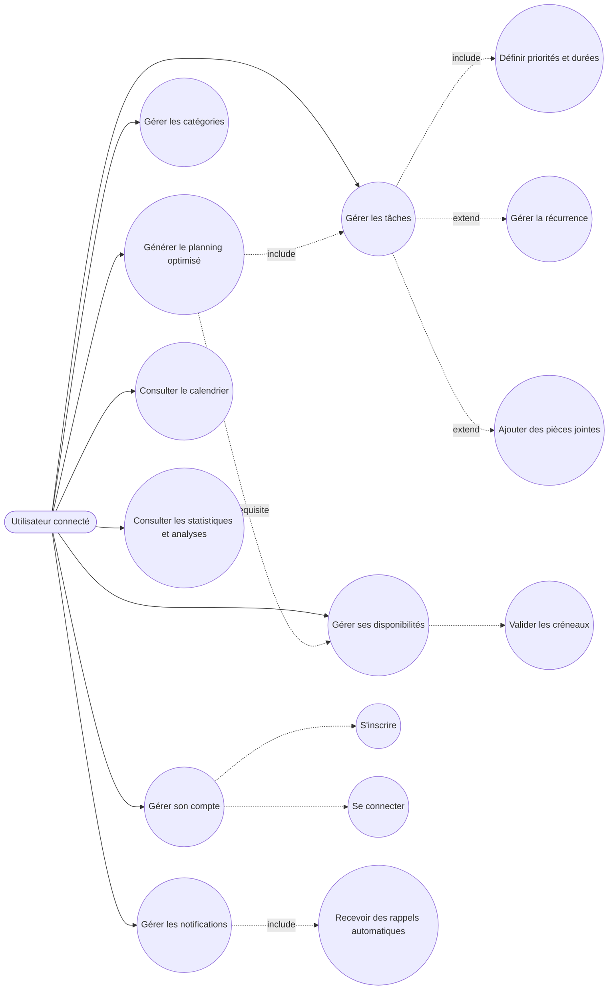
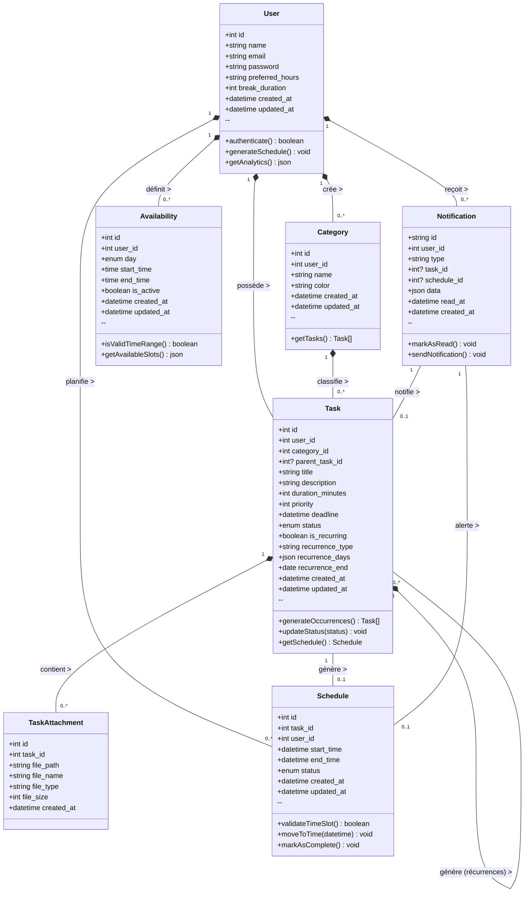
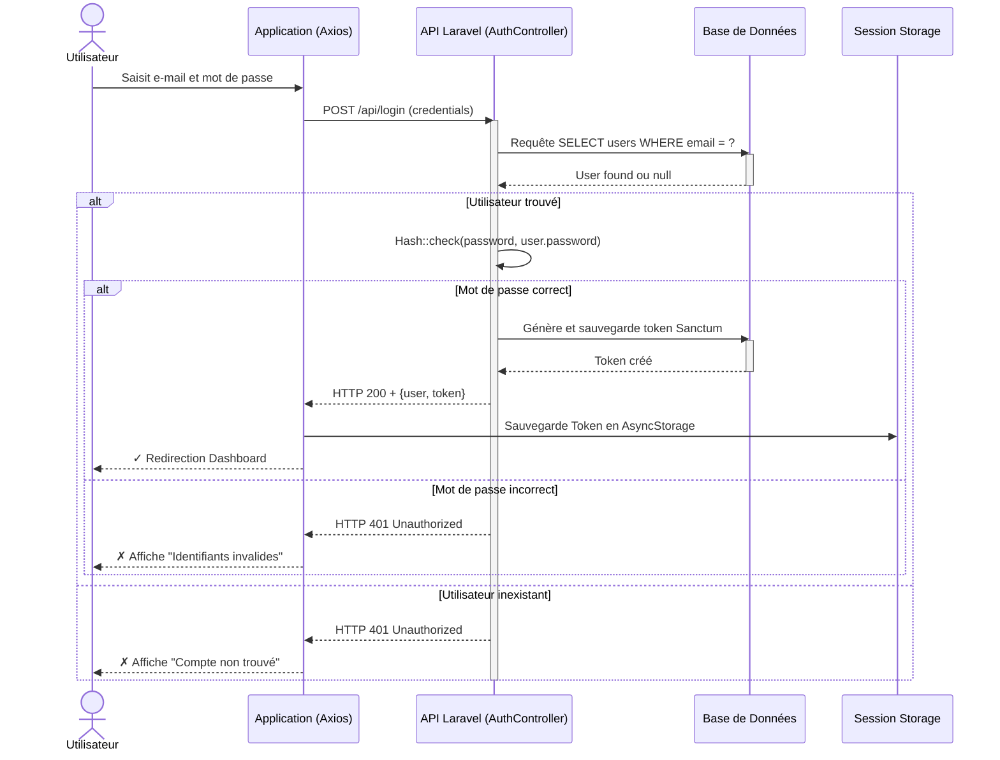
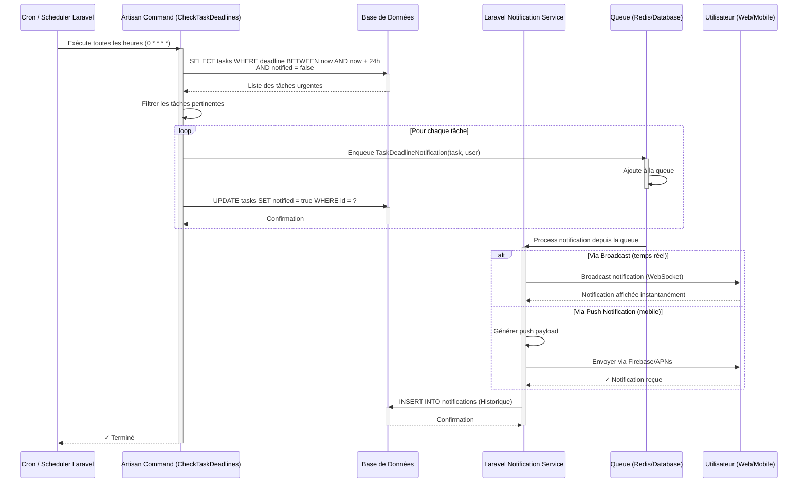
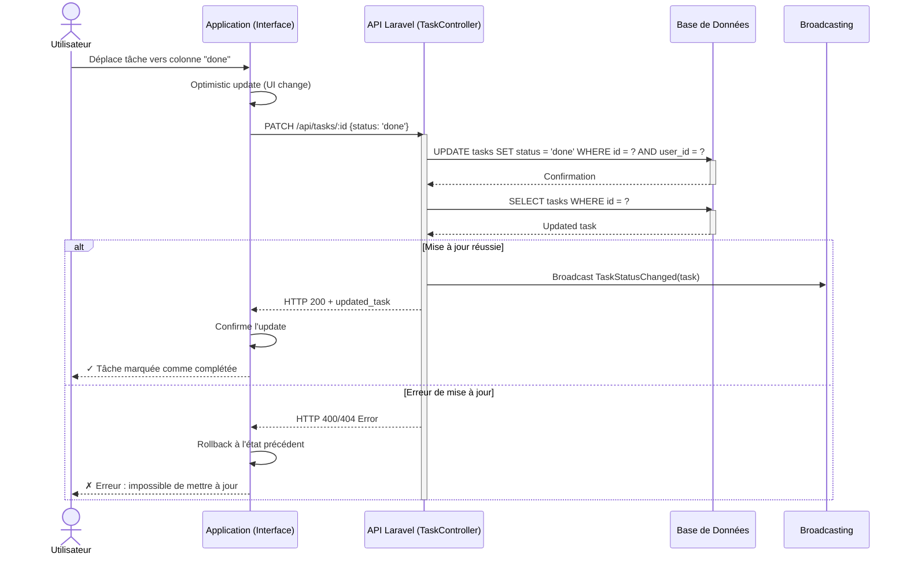

# Modélisation UML - SmartSchedule

Ce document regroupe les diagrammes UML (Cas d'utilisation, Classes, Séquences) ainsi que les tableaux de scénarios demandés pour le projet de gestion d'emploi du temps **SmartSchedule**.

---

## 1. Diagramme de Cas d'Utilisation (Globale)

Les cas d'utilisation couvrent les interactions possibles de l'utilisateur avec le système (valable pour l'Application Web et Android).



**Notes :**
- La génération du planning nécessite que les disponibilités soient configurées au préalable
- Les tâches doivent exister avant de générer un planning
- Les attachments et la récurrence sont des extensions optionnelles

---

## 2. Diagramme de Classes

Ce diagramme illustre les entités du système, leurs attributs clés et leurs relations (cardinalités d'après le MCD MySQL).



**Relations expliquées :**
- Un utilisateur peut avoir plusieurs tâches, catégories, disponibilités et planifications
- Une tâche peut avoir plusieurs attachments et générer des occurrences récurrentes
- Un planning (Schedule) est généré à partir d'une tâche
- Les notifications sont liées à des tâches ou des planifications

---

## 3. Diagrammes de Séquences

### Séquence 1 : Processus d'Authentification (via API Laravel)



---

### Séquence 2 : Génération Intelligente du Planning

```mermaid
sequenceDiagram
    actor U as Utilisateur
    participant M as Application (Web/Android)
    participant A as API Laravel (ScheduleController)
    participant E as Moteur d'Optimisation
    participant D as Base de Données

    U->>M: Clique sur "Générer le planning"
    M->>A: POST /api/schedule/generate
    activate A
    
    %% Récupération des données
    A->>D: SELECT tasks WHERE user_id = ? AND status = 'todo'<br/>ORDER BY priority DESC, deadline ASC
    activate D
    D-->>A: Liste des tâches à planifier
    deactivate D
    
    A->>D: SELECT availabilities WHERE user_id = ? AND is_active = true
    activate D
    D-->>A: Plages horaires disponibles
    deactivate D
    
    %% Optimisation
    A->>E: Appel algorithme d'optimisation(tasks, availabilities)
    activate E
    E->>E: Validation des contraintes
    E->>E: Tri par priorité et deadline
    E->>E: Allocation des créneaux
    E->>E: Vérification des chevauchements
    E->>E: Ajustement des pauses
    
    alt Allocation réussie
        E-->>A: schedules[] validés
        deactivate E
        
        A->>D: DELETE schedules WHERE user_id = ? (Réinitialisation)
        activate D
        D-->>A: Confirmation
        deactivate D
        
        A->>D: INSERT INTO schedules (Nouveaux créneaux)
        activate D
        D-->>A: Confirmation + IDs
        deactivate D
        
        A-->>M: HTTP 200 + {schedules[], success: true}
        M->>M: Met à jour le calendrier
        M-->>U: ✓ Planning généré avec succès
        
    else Impossible d'allouer toutes les tâches
        E-->>A: {schedules[], warnings[], unscheduled[]}
        deactivate E
        
        A->>D: INSERT INTO schedules (Créneaux partiels)
        activate D
        D-->>A: Confirmation
        deactivate D
        
        A-->>M: HTTP 200 + {schedules[], warnings, unscheduled}
        M-->>U: ⚠ Planning généré partiellement (tâches non planifiées)
    end
    
    deactivate A
```

---

### Séquence 3 : Notification de Rappel Automatique (Cron Job / Scheduler)



---

### Séquence 4 : Changement de Statut de Tâche (Drag & Drop)



---

## 4. Tableau de Scénarios d'Utilisation

Voici la liste des scénarios d'utilisation principaux qui cadrent les tests fonctionnels et l'expérience utilisateur.

| ID | Cas d'Utilisation | Pré-condition | Scénario Nominal (Succès) | Scénario Alternatif (Échec / Exception) | Post-condition |
|:---|:---|:---|:---|:---|:---|
| **SC01** | Connexion à l'application | L'utilisateur possède un compte existant. | L'utilisateur saisit ses identifiants valides (email/password). L'API vérifie les credentials, génère un token JWT/Sanctum. L'utilisateur est redirigé vers le Dashboard. | (A) Email inexistant → Message "Compte non trouvé". (B) Mot de passe incorrect → Message "Identifiants invalides". (C) Serveur indisponible → Message "Erreur de connexion". | L'utilisateur est authentifié, le token est stocké en AsyncStorage, accès à tous les cas d'utilisation accordé. |
| **SC02** | Création d'une tâche | Utilisateur authentifié sur le Dashboard. | L'utilisateur remplit le formulaire : Titre, Description (optionnel), Catégorie, Durée (min), Priority, Deadline. Soumet le formulaire. La tâche est insérée en base de données avec status='todo'. La liste des tâches se met à jour. | (A) Titre vide → Message "Le titre est requis". (B) Durée négative → Message "Durée invalide". (C) Deadline passée → Message d'avertissement "La deadline est passée". (D) Erreur base de données → Rollback, message "Erreur lors de la création". | La tâche apparaît dans la liste avec status='todo', prête à être planifiée. |
| **SC03** | Configuration des disponibilités | Utilisateur authentifié sur la page Disponibilités. | L'utilisateur sélectionne un jour (ex: Lundi), configure les heures (09:00-17:00) avec optionnellement des pauses. Clique "Sauvegarder". Les créneaux sont insérés en base. L'interface affiche les heures configurées. | (A) Heure de fin antérieure à l'heure de début → Message "Heure de fin invalide". (B) Créneau chevauche un existant → Option de remplacer/fusionner. (C) Erreur réseau → Message "Impossible de sauvegarder". | Les disponibilités sont persistées en base, le planning futur tiendra compte de ces créneaux. |
| **SC04** | Génération du Planning | Utilisateur possède des tâches `todo` et des disponibilités valides configurées. | L'utilisateur clique sur "Générer le planning". L'API combine les tâches (triées par priorité/deadline) et les disponibilités. L'algorithme alloue chaque tâche à un créneau disponible. Les planifications sont insérées en base. Le calendrier se met à jour avec les tâches planifiées. | (A) Pas de tâche `todo` → Message "Aucune tâche à planifier". (B) Pas de disponibilités → Message "Configurez d'abord vos disponibilités". (C) Impossible d'allouer toutes les tâches → Planning partiel, liste des tâches non planifiées affichée. | Les tâches planifiées passent à status='scheduled', visibles dans le calendrier avec horaires définis. |
| **SC05** | Changement de statut de tâche (Drag & Drop) | L'utilisateur possède une tâche planifiée dans le calendrier. | L'utilisateur déplace la tâche de la colonne "scheduled" à "done" (drag & drop). L'interface met à jour optimistiquement. L'API envoie PATCH /api/tasks/:id {status: 'done'}. La base de données enregistre la modification. | (A) Déplacement annulé/invalide → Tâche revient à sa position initiale. (B) Erreur réseau lors du PATCH → Rollback, notification d'erreur. (C) Conflit (tâche supprimée entre-temps) → Message "Tâche inexistante". | La tâche est marquée comme complétée (status='done'), l'indicateur visuel (couleur) repasse au vert, elle disparaît de la colonne "scheduled". |
| **SC06** | Configuration de la récurrence | L'utilisateur crée ou modifie une tâche. | L'utilisateur active l'option "Tâche récurrente". Sélectionne le type : Quotidien, Hebdomadaire, Mensuel. Pour Hebdomadaire : sélectionne les jours (ex: Lundi, Mercredi). Configure la date de fin (optionnel). Soumet. La tâche est marquée is_recurring=true, recurrence_type='weekly', recurrence_days=['Monday','Wednesday']. | (A) Aucun jour sélectionné (Hebdo/Mensuel) → Message "Sélectionnez au moins un jour". (B) Date de fin antérieure à aujourd'hui → Message "Date de fin invalide". (C) Récurrence infinie sans fin définie → Demande confirmation. | La tâche principale est créée, des occurrences sont générées automatiquement pour la prochaine période (ex: 12 semaines), chacune planifiable individuellement. |
| **SC07** | Consultation des Analytics | Utilisateur authentifié avec historique de tâches (au minimum quelques tâches terminées). | L'utilisateur ouvre l'onglet "Analytics". L'API calcule : (1) Taux de complétion (done/total), (2) Temps moyen par catégorie, (3) Tâches en retard (deadline passée + status != 'done'), (4) Tendances temporelles. Les graphiques et statistiques s'affichent. | (A) Aucune tâche en historique → Message "Pas assez de données" avec un graphique vide. (B) Serveur ne peut calculer les stats → Message "Erreur lors du calcul des statistiques". (C) Données incohérentes en base → Affiche les données disponibles avec warning. | L'utilisateur visualise ses performances, tendances de productivité, points faibles et points forts. |
| **SC08** | Réception de Notification de Rappel | Une tâche approche de sa deadline (< 24h) et le serveur exécute le Cron Job (CheckTaskDeadlines). | Le Cron détecte la tâche. Crée une notification (type='task_deadline_reminder'). Envoie un Broadcast (temps réel) et/ou Push Notification (mobile). L'utilisateur voit une notification sur son dashboard ou reçoit une alerte mobile. L'historique de notification est enregistré. | (A) Tâche déjà notifiée (notified=true) → Skipped, aucune nouvelle notification. (B) Utilisateur a désactivé les notifications → Notification créée mais pas d'alerte enviée. (C) Service de notification indisponible → Notification enregistrée, tentative d'envoi ultérieure via Queue. | L'utilisateur est alerté de l'urgence de la tâche, peut décider de l'action (compléter, reporter, supprimer). Notification marquée comme lue après consultation. |

---

## 5. Notes d'Implémentation Laravel

### Validation des Contraintes
- **Task.duration_minutes** : Doit être > 0 et ≤ 1440 (24h)
- **Task.priority** : Valeurs acceptées : 1 (basse), 2 (moyenne), 3 (haute)
- **Schedule** : Vérifier absence de chevauchements pour le même utilisateur
- **Availability** : start_time < end_time, pas de doublons par (user_id, day)

### Endpoints API Clés
- `POST /api/login` → Authentification
- `POST /api/tasks` → Créer une tâche
- `GET /api/tasks` → Lister les tâches
- `PATCH /api/tasks/{id}` → Modifier une tâche
- `POST /api/availabilities` → Configurer disponibilités
- `POST /api/schedule/generate` → Générer le planning
- `GET /api/analytics` → Récupérer les statistiques
- `GET /api/notifications` → Lister les notifications

### Cron Jobs
- `schedule:run` → Exécute CheckTaskDeadlines toutes les heures (à configurer dans `app/Console/Kernel.php`)

---

## 6. Considérations de Sécurité & Performance

✅ **Authentification** : Token Sanctum avec expiration  
✅ **Validation** : Côté serveur (Laravel Rules) + côté client (React/Vue)  
✅ **Autorisation** : Vérifier user_id sur chaque requête (policy)  
✅ **Rate Limiting** : Throttle sur /api/schedule/generate  
✅ **Caching** : Cache les disponibilités & tâches avec TTL  
✅ **Index Base de Données** : Créer index sur (user_id, status), (user_id, deadline)

