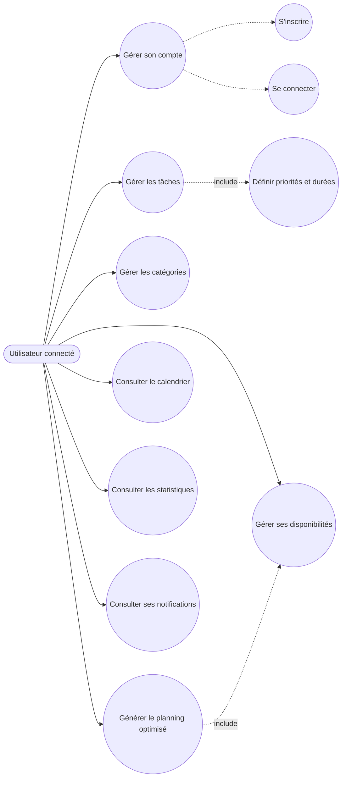
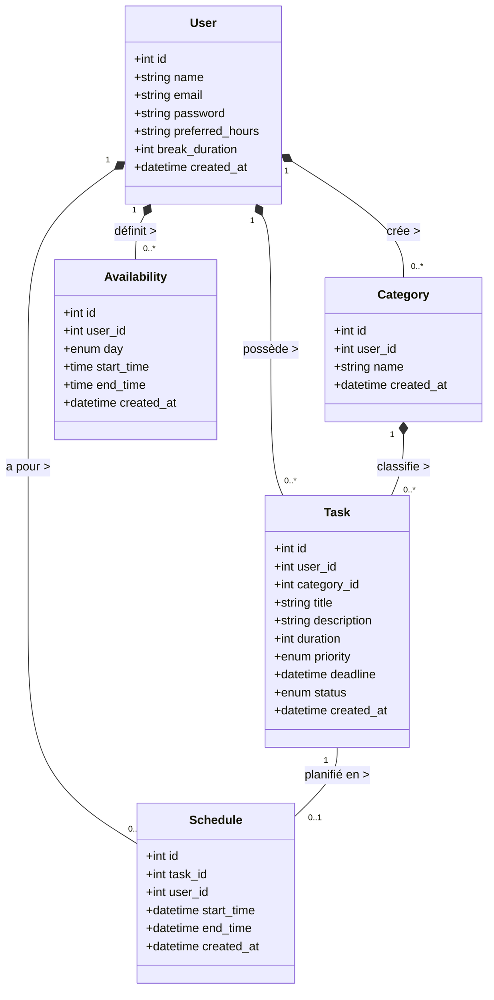
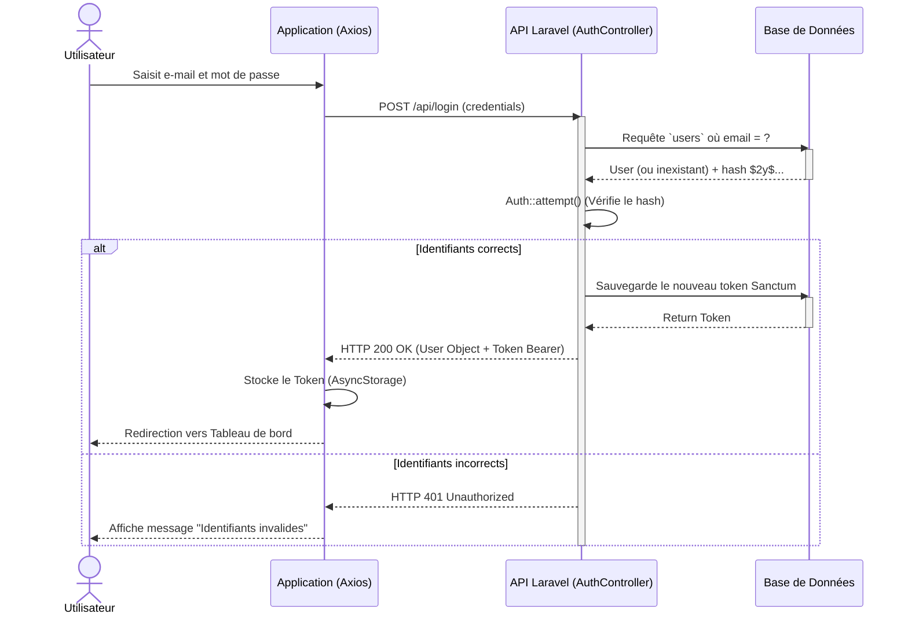
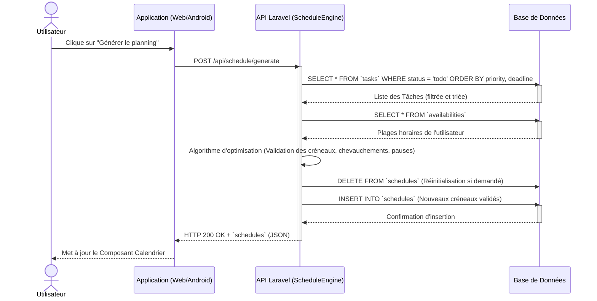

# Modélisation UML - SmartSchedule

Ce document regroupe les diagrammes UML (Cas d'utilisation, Classes, Séquences) ainsi que les tableaux de scénarios demandés pour le projet de gestion d'emploi du temps **SmartSchedule**.

---

## 1. Diagramme de Cas d'Utilisation (Globale)

Les cas d'utilisation couvrent les interactions possibles de l'utilisateur avec le système (valable pour l'Application Web et Android).

---

## 2. Diagramme de Classes

Ce diagramme illustre les entités du système, leurs attributs clés et leurs relations (cardinalités d'après le MCD MySQL).

---

## 3. Diagrammes de Séquences

### Séquence 1 : Processus d'Authentification (via API)

### Séquence 2 : Génération Intelligente du Planning

---

## 4. Tableau de Scénarios d'Utilisation

Voici la liste des scénarios d'utilisation principaux qui cadrent les tests fonctionnels et l'expérience utilisateur.

| ID | Cas d'Utilisation | Pré-condition | Scénario Nominal (Succès) | Scénario Alternatif (Échec / Exception) | Post-condition |
|:---|:---|:---|:---|:---|:---|
| **SC01** | Connexion à l'application | L'utilisateur possède un compte existant. | L'utilisateur saisit ses identifiants valides. L'API renvoie un Token JWT. L'utilisateur est redirigé vers l'Accueil. | E-mail ou mot de passe incorrect. Le système refuse l'accès et affiche une erreur. | Une session locale est activée (Token stocké). |
| **SC02** | Création d'une tâche | Utilisateur authentifié sur le Dashboard. | L'utilisateur remplit le formulaire avec un Titre, une Durée (min) et une Deadline. La tâche est insérée en base avec statut `todo`. | Le titre manque ou la durée est invalide. L'API renvoie un code 422 HTTP (Validation Error). | La tâche apparaît dans la liste des tâches à faire. |
| **SC03** | Configuration des disponibilités | Utilisateur authentifié. | L'utilisateur sélectionne un jour (ex: Lundi) et configure la plage 09:00 à 17:00. Il sauvegarde. | Une plage de fin arrive avant la plage de début. L'application bloque l'envoi. | La disponibilité est enregistrée et sera utilisée pour l'algoritme. |
| **SC04** | Génération du Planning | Utilisateur possède des tâches `todo` et des disponibilités valides. | L'utilisateur clique sur "Générer". L'API combine tâches et dispos, insère les données et renvoie le calendrier rempli. | L'utilisateur a 20h de tâches mais seulement 10h de disponibilités. Le serveur notifie que des tâches resteront non-placées. | Le planning visuel est rempli (Calendrier web et app rafraîchi). |
| **SC05** | Changement de statut de tâche (Drag & Drop) | L'utilisateur possède une tâche planifiée dans le calendrier. | L'utilisateur déplace la tâche dans la colonne `done`. L'application envoie une requête PUT. | Problème réseau. La Tâche revient à sa position initiale. | La tâche est marquée comme complétée et l'indicateur repasse au vert. |
